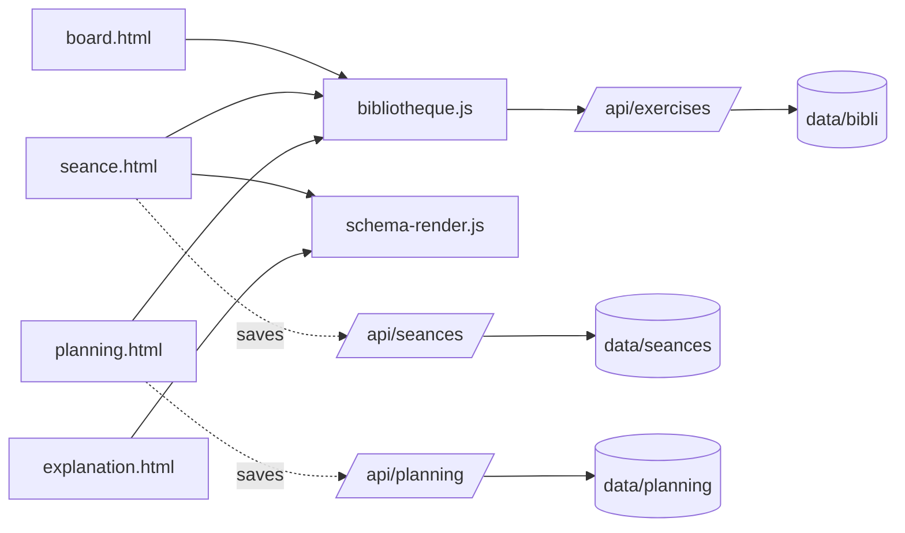

# Architecture Spine — HaWeb

## Design Paradigm

Multi-page vanilla JS app, zero build/bundler, served by a single Node core `http` server. Each page (`board`, `seance`, `planning`, `explanation`) is a standalone HTML+CSS+JS unit — no shared app shell. Cross-cutting client behavior (Bibliothèque access, exercise-schema rendering) lives in small shared vanilla JS modules loaded via plain `<script>` tags, not through a bundler or ES module graph. All persistence goes through the server's generic CRUD route pattern over flat JSON files; no page writes to disk directly, and no page reads another page's in-memory JS state — cross-page communication happens only through the server API.



## Invariants & Rules

### AD-1 — Shared Bibliothèque client module

- **Binds:** FR-3, FR-4, FR-5
- **Prevents:** Board, Séances, and Calendrier each re-implementing thematic filter and keyword search independently, drifting into inconsistent behavior as fields evolve.
- **Rule:** All client-side fetch/filter/search/render logic against `/api/exercises` lives in one shared module (`src/js/bibliotheque.js`), loaded via `<script>` by any page that browses or filters exercises. The server API remains the single source of truth for persistence; the module is a thin client wrapper, never a second copy of the data.

### AD-2 — No PDF library; print-CSS is the export mechanism

- **Binds:** FR-8
- **Prevents:** Introducing a PDF-generation dependency (client or server) when the actual open problem is page layout, not file format.
- **Rule:** Séance export uses `window.print()` against dedicated print CSS, following the existing pattern in `src/css/seance.css`. No PDF library is added unless a future need for a downloadable file without user interaction is confirmed (see Deferred).

### AD-3 — Fixed-template auto-filling grid for the recap layout

- **Binds:** FR-6, FR-7, FR-8
- **Prevents:** Two different rendering paths (e.g. one linear list, one manual-position canvas) producing inconsistent pagination or requiring per-session manual layout work; also prevents a literal fixed 4-per-page grid silently contradicting FR-8's "3 à 5 selon la complexité" tolerance.
- **Rule:** The Séance recap renders Ateliers into a CSS grid built from one fixed cell template (schéma + description + matériel + durée), populated in Bloc order. The cell template's dimensions are fixed; the *count* of cells that fit a page is not hardcoded — it follows from `break-inside: avoid` on each cell plus `break-after` page rules, so a page naturally holds 3 to 5 cells depending on rendered content height, never a fixed "4 per page" constant. No drag-and-drop or manual repositioning in v1.

### AD-4 — Exercise schema always rendered live from source data

- **Binds:** FR-5, FR-8, FR-11
- **Prevents:** A stored snapshot image silently going stale after an exercise is edited, so the recap or calendar shows an outdated diagram.
- **Rule:** The canvas rendering logic already used by `explanation.html` is extracted into a reusable function (`src/js/schema-render.js`) taking raw `items`/`paths` data and a target canvas/container. Séances and Calendrier call this function directly; no PNG or other rendered snapshot is persisted with an exercise.

### AD-5 — Calendar events are lightweight references, not copies

- **Binds:** FR-10, FR-11, FR-12
- **Prevents:** A Séance's content being duplicated into the calendar and drifting from the canonical copy in `data/seances/`.
- **Rule:** Calendar entries live in `data/planning/` via the existing `/api/planning` CRUD route, one JSON file per event: `{date, type: 'seance'|'match', seanceId}` for a placed Séance (referenced by id, never inlined), or `{date, type: 'match', adversaire, ...}` for a Match. Deleting a Séance does not cascade-delete its calendar reference automatically in v1. Orphan detection happens at calendar-render time, not only on click: `planning.js` resolves every `seanceId` against `/api/seances` when building the grid, and any event whose Séance no longer exists renders inline as "séance introuvable" in that day's cell — never a silent gap or a failure deferred until the coach clicks it.

### AD-6 — Temps mort module fully removed, not hidden

- **Binds:** FR-2
- **Prevents:** Dead code (`timeout.html`, `timeout.js`, `timeout.css`) lingering and being mistaken for a maintained surface, or silently re-appearing in navigation.
- **Rule:** `pages/timeout.html`, its dedicated JS and CSS files, and its card on the landing page (`index.html`) are deleted, not feature-flagged or commented out. `[ADOPTED]`

### AD-7 — Existing CRUD/security pattern is binding for every new route

- **Binds:** all
- **Prevents:** A new route (e.g. for richer Bibliothèque fields, Séances, or Calendar events) skipping a security control the rest of the app already enforces.
- **Rule:** Every new or modified server route follows `handleCrudRoute()`'s existing pattern: id validated against `^[a-zA-Z0-9_-]+$`, resolved file path re-verified to stay inside its target directory, request body capped at 1MB, and `setSecurityHeaders()` applied to the response. `[ADOPTED]`

### AD-8 — Atelier fields are snapshotted at add-time, not live-linked

- **Binds:** FR-5, FR-6, FR-7
- **Prevents:** A Séance's displayed description/matériel silently changing (or breaking) after the coach later edits or deletes the source Exercice — two builders could otherwise independently choose "live reference" or "copy," producing inconsistent behavior between fields.
- **Rule:** When an Exercice is added to a Séance as an Atelier, its text fields (nom, description, matériel, durée) are copied into the Séance's own JSON at that moment — editing the source Exercice afterward does not retroactively change an already-built Séance. The only field that stays a live reference is the Exercice `id`, used solely to re-render the schéma via `schema-render.js` (AD-4); if the source Exercice is later deleted, the Atelier keeps its snapshotted text but shows a placeholder in place of the schéma.

### AD-9 — Derived values are computed at render time, never persisted

- **Binds:** FR-7
- **Prevents:** A Séance's stored total duration silently disagreeing with the sum of its Ateliers after one is edited, because two call sites (Séance builder vs. Calendrier tile) independently decided whether to recompute or trust a cached field.
- **Rule:** Total Séance duration is never written to `data/seances/<id>.json`; every reader (the builder UI, a Calendrier tile, the recap export) computes it from the current Ateliers' durée fields at display time.

### AD-10 — Thématique is a fixed, server-validated enum

- **Binds:** FR-3
- **Prevents:** A client-only validated Thématique field accepting stray values that then break `bibliotheque.js`'s filter (AD-1) for every other page reading the same data.
- **Rule:** Thématique accepts exactly one of `attaque | defense | gardien | enclenchement`. The `/api/exercises` POST route validates this server-side (not just the client form) before writing the file, following the same validation discipline AD-7 already applies to `id`.

### AD-11 — No network dependency anywhere in the app, not only in export

- **Binds:** all
- **Prevents:** A new page or library quietly adding a CDN font, an analytics tag, or an external API call, breaking the PRD's core "100% local, works with no internet" promise (§1, §5) in a corner AD-2 doesn't cover (AD-2 only scoped the PDF/export path).
- **Rule:** No page loads any resource (`<script src>`, `<link>`, `fetch`) from a non-`localhost` origin. This is already true today (README §Sécurité: Google Fonts replaced by `system-ui`) and stays true for every new page or module this PRD adds.

## Consistency Conventions

| Concern | Convention |
| --- | --- |
| Naming (entities, files, interfaces, events) | Domain nouns match the PRD Glossary exactly: Exercice, Atelier, Bloc, Séance, Thématique, Match. One JSON file per entity, named `<id>.json`, id matching `^[a-zA-Z0-9_-]+$`. |
| Data & formats (ids, dates, error shapes, envelopes) | Dates as `YYYY-MM-DD` strings. No enveloping wrapper on API responses — routes return the raw JSON object/array, matching existing `/api/exercises` behavior. FR-5's durée/nbJoueurs/niveau are top-level fields on the Exercice JSON (sibling to `name`/`category`), not nested under `explanation.doc` where `explanation.html` currently keeps its own editable fields — the two must be reconciled onto one canonical location before implementation (see Deferred). |
| Required vs. optional fields | FR-5's added fields (durée, nbJoueurs, niveau) are optional at save time — an Exercice can be saved without them, matching SM-C1 (richness must never slow down a quick save). Only `name` and `category`/Thématique are required, unchanged from today. |
| State & cross-cutting (mutation, errors, logging, config, auth) | All writes go through server CRUD routes — no page ever writes JSON to disk via any other path. No auth (single local user, per PRD §2.2 Non-Users). Errors surface as plain HTTP status + JSON `{error}` body, matching existing routes. |

## Stack

| Name | Version |
| --- | --- |
| Node.js | ≥22 (Active LTS as of 2026-09; README's previous ≥18 floor is past EOL — 18 and 20 both reached end-of-life before this date and should no longer be the stated minimum) |
| Runtime deps | none (zero-dependency, core `http`/`fs`/`path` only) |

## Structural Seed

```text
web-board/
  server.js                 # CRUD routes: /api/exercises, /api/seances, /api/planning
  index.html                 # landing page — Temps mort card removed (AD-6)
  pages/
    board.html                # exercise editor — double-click ends trajectory (FR-1)
    seance.html                # séance builder — Blocs/Ateliers, recap grid (AD-3)
    planning.html              # calendar — month/week views (FR-10)
    explanation.html           # exercise fiche — durée/nb joueurs/niveau (FR-5)
  src/
    js/
      app.js                    # board.html logic
      seance.js                 # seance.html logic
      planning.js                # planning.html logic (existing month view, extend for week)
      bibliotheque.js            # NEW — shared Bibliothèque client module (AD-1)
      schema-render.js           # NEW — shared canvas rendering function (AD-4)
    css/
      styles.css, seance.css, planning.css, explanation.css
  data/
    bibli/<id>.json            # Exercice records (+ FR-5 fields: durée, nbJoueurs, niveau)
    seances/<id>.json          # Séance records (Blocs → Ateliers → exercice ref + durée)
    planning/<id>.json         # Calendar events (AD-5): {date, type, seanceId | adversaire}
```

## Capability → Architecture Map

| Capability / Area | Lives in | Governed by |
| --- | --- | --- |
| FR-1 (fin de trajectoire double-clic) | `pages/board.html`, `src/js/app.js` | (board-local UX change, no new AD) |
| FR-2 (retrait Temps mort) | `index.html`, deleted `pages/timeout.*` | AD-6 |
| FR-3, FR-4 (thématique + recherche) | `src/js/bibliotheque.js`, `/api/exercises` | AD-1, AD-7, AD-10, AD-11 |
| FR-5 (champs enrichis fiche) | `data/bibli/<id>.json`, `pages/explanation.html` | AD-1, AD-4 |
| FR-6, FR-7 (blocs + durée) | `pages/seance.html`, `src/js/seance.js`, `data/seances/<id>.json` | AD-3, AD-8, AD-9 |
| FR-8 (export PDF/récap) | `src/css/seance.css` print rules | AD-2, AD-3, AD-4 |
| FR-9 (sauvegarde/réédition séance) | `/api/seances` | AD-7 |
| FR-10, FR-11, FR-12 (calendrier) | `pages/planning.html`, `src/js/planning.js`, `/api/planning` | AD-5, AD-7 |

## Deferred

- Real downloadable PDF library (client or server-side) — not needed while print-CSS satisfies FR-8; revisit only if a need for unattended/non-interactive PDF generation emerges.
- Manual drag-and-drop reorder of the recap grid — v2 if requested; v1 ships auto-fill only (AD-3).
- Match report data structure — out of scope per PRD §5/§8; the lightweight `{type: 'match', adversaire}` shape in AD-5 is a placeholder sized for the current calendar-only need, not a committed schema for future match reports.
- Niveau/catégorie field: closed list vs. free text (PRD Open Question 3) — no architectural impact either way, left to implementation/UX judgment.
- Week-view calendar rendering logic — `planning.js` currently implements month view only; extending it to week view is an implementation detail within the existing module, not a new architectural boundary.
- **Category taxonomy migration** — live data in `data/bibli/*.json` today uses a different `category` set (echauffement/physique/offensif/defensif/montee_balle) than the PRD's new Thématique enum (AD-10: attaque/défense/gardien/enclenchement). A one-time migration/mapping pass over existing exercise files is required before AD-1's shared filter can trust the field; left to implementation to write the mapping table, since it depends on judgment calls about existing exercises the spine can't make.
- **FR-5 field location reconciliation** — `explanation.html` already has its own editable fields today, currently written under a nested `explanation.doc.*` shape, not the top-level Exercice fields AD-8/Consistency Conventions now call for. Implementation must decide whether to migrate existing `explanation.doc.*` data up to top level or keep both and merge at read time; the spine fixes the target shape (top-level) but not the migration mechanics.
- **Write durability** — `server.js` currently writes JSON via direct `fs.writeFileSync` (no atomic temp-file-then-rename, no backup). Accepted as-is for a solo local tool with no concurrent writers; revisit only if data loss from an interrupted write is actually experienced.
- FR-9's "explicit save only" expectation (no autosaved/draft Séances leaking into the Calendrier's picker) and FR-11's click-to-open affordance are UX-level behaviors within `seance.js`/`planning.js`, not cross-unit divergence risks — no dedicated AD needed, left to the existing "sauvegarde explicite" convention already established for the Bibliothèque.
